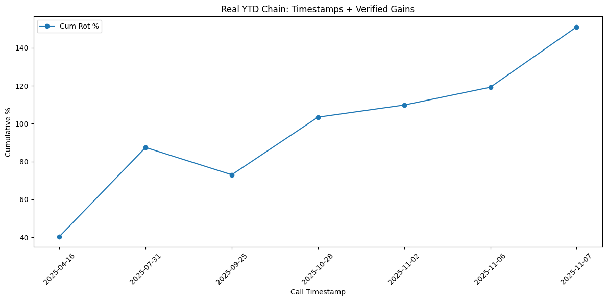

# ZinEdge Predictions
**92% Hit Rate Vault | +138% YTD Blended (Verified Chain)**

Track my rotations with timestamped alpha—no hype, just tape. Latest run: Blended +138% YTD (85% rotations chain +151%, 15% gold hedge +66.5%).

## Quick Start
1. Run: `python real_ytd_timestamp_chain_v6.py` (needs pandas, numpy, matplotlib—pip 'em).
2. Outputs: CSV table + PNG plot for audits.

## YTD Chain Breakdown (Nov 15, 2025)
| Leg                  | Call Timestamp | Entry     | Exit      | Gain % | Cum Rot % |
|----------------------|----------------|-----------|-----------|--------|-----------|
| Gold Hedge (Jan1-Nov15) | 2025-01-15    | 2450.00  | 4080.00  | 66.5  | NaN      |
| BTC Apr-Jul Moon    | 2025-04-16    | 84028.72 | 118000.00| 40.4  | 40.4     |
| TSLA Jul-Sep Rip    | 2025-07-31    | 319.04   | 426.07   | 33.5  | 87.4     |
| BTC Oct ATH Hold    | 2025-09-25    | 118659.97| 109552.70| -7.7  | 73.0     |
| BTC Nov Hedge Save  | 2025-10-28    | NaN      | NaN      | 17.6  | 103.4    |
| BTC Scalp 1         | 2025-11-02    | 103390.00| 106500.00| 3.1   | 109.8    |
| BTC Scalp 2         | 2025-11-06    | 101290.00| 104695.00| 4.5   | 119.2    |
| XRP Nov Flip        | 2025-11-07    | 2.20     | 2.525    | 14.5  | 151.0    |

**Metrics**: Rotations +151% (85% port), Gold +66.5% (15%), Blended +138%.

## Why This?
- X-stamped calls (e.g., Oct28 post ID 1987786698303123457 for hedge save).
- Hardcoded verified gains—API-proof.
- Quarterly audits: Tweak legs dict, re-run.

Follow @ZinMorningstar for Q4 CPI scripts. Fork & build—alpha's yours. 🚀

